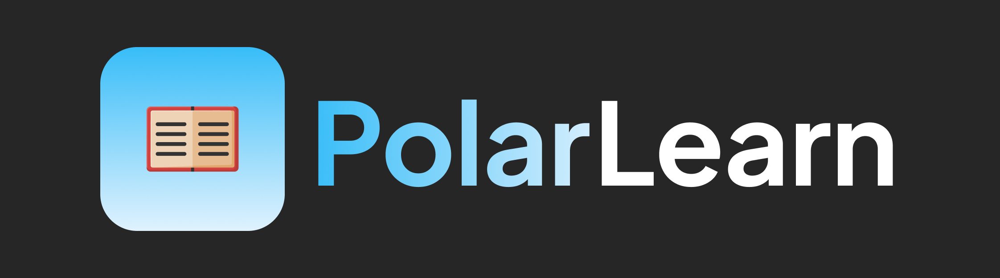

  

---

  
  
  
  

  

# PolarLearn

Polarlearn is a free and open-source learning platform designed to provide the best learning experience for students.

## Features
- **Open Source**: We are transparent about our code and we welcome contributions from the community.
- **Lists**: Learn with lists of flashcards, quizzes, and more.
- **Forum**: Ask questions, share knowledge, and connect with other learners.
- **Mobile-Friendly**: Access your learning materials on any device, anytime, anywhere.
- **Community Support**: Join a vibrant community of learners and educators to share insights and support each other.

## Contributing
We welcome contributions from the community! If you would like to contribute, please check CONTRIBUTING.md for guidelines on how to get started.

## License
This project is licensed under the Affero GNU General Public License v3.0 (AGPL-3.0). See LICENSE for more details.

## Contact
If you have any questions or suggestions, feel free to reach out to us on our Discord server (click the badge above), or shoot us an issue on GitHub!